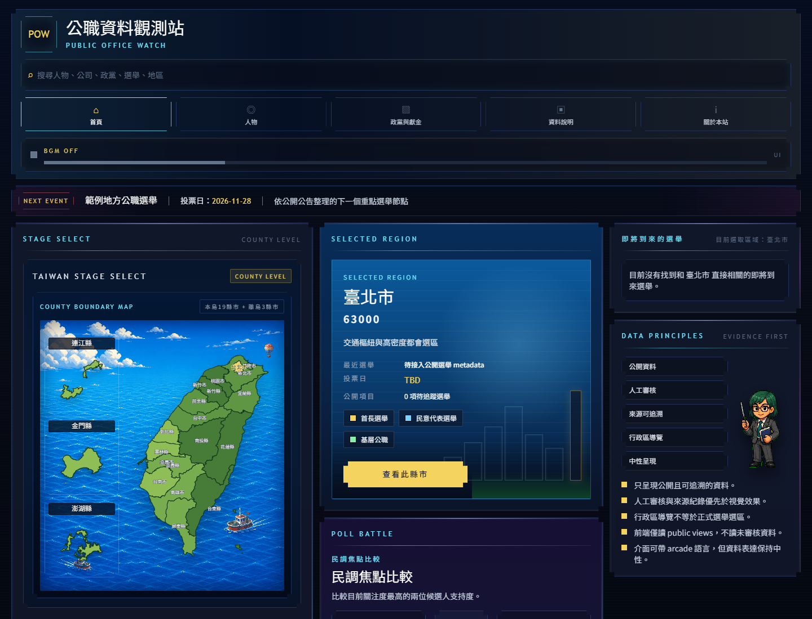
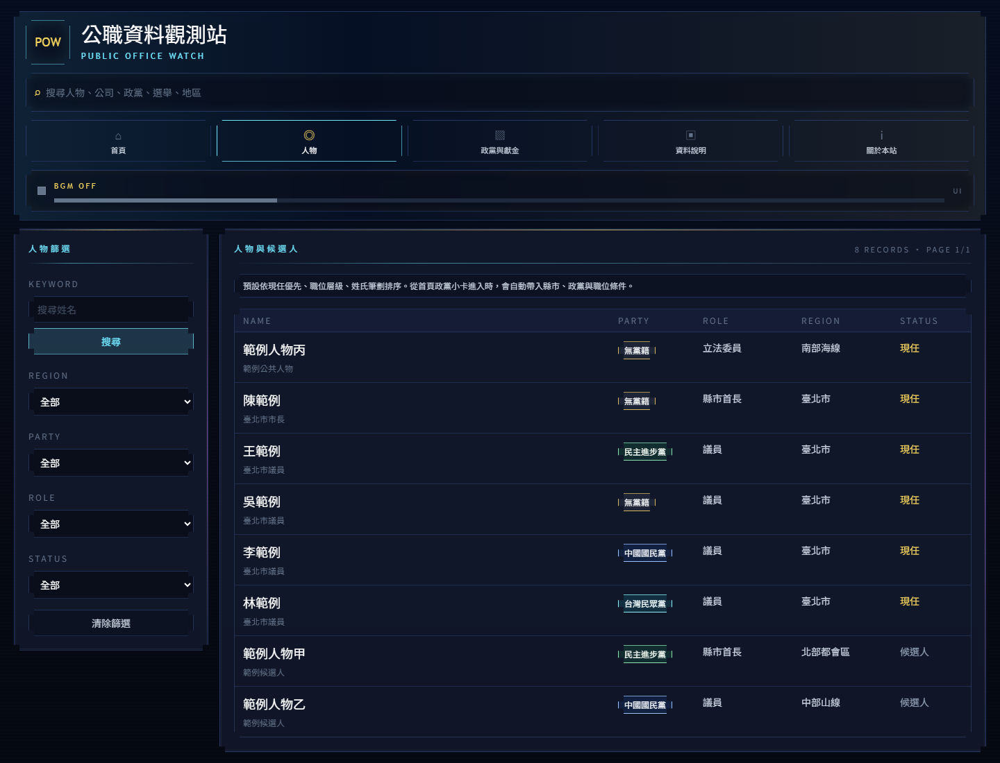
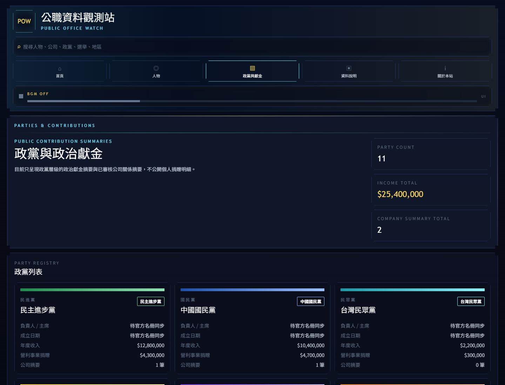

# Public Office Watch

Public Office Watch 是一個整理台灣公職人物、候選人、政黨與政治獻金公開資料的網站。

網站目標是把分散在不同公開來源的選舉、公職、政黨、政治獻金與人物資料整理成容易查閱、可追溯來源、能逐步審核的公開資訊入口。

## 目前主要頁面

### 首頁

首頁以台灣地圖作為主要入口，預設顯示選取縣市的公開資料摘要。

目前首頁重點包含：

- 縣市與離島地圖選擇
- 選取縣市的基本選舉資訊
- 即將到來的選舉項目
- 縣市公職摘要，例如縣市長、地方民意代表政黨統計
- 資料原則摘要

首頁的設計方向是讓使用者先從地區進入，再逐步查到該地區相關人物、候選人與選舉項目。

### 人物與候選人

人物頁整理目前公開資料中可查詢的公職人物與候選人。

列表支援依地區、政黨、職位、狀態與姓名搜尋篩選，並以現任優先、職位層級、姓氏筆劃作為預設排序。

人物詳情頁預計整理：

- 基本資料
- 現職與參選紀錄
- 經歷與學歷
- 政治獻金摘要
- 政見與後續追蹤
- 可公開的來源連結

尚未確認或仍待審核的資料不會直接作為確定事實呈現。

### 政黨與獻金

政黨與獻金頁整理政黨基本資料、年度政治獻金摘要，以及已審核的公司層級關係摘要。

目前此頁的呈現原則是：

- 以政黨層級摘要為主
- 顯示收入、支出與不同捐贈類型的彙總
- 顯示公司或營利事業捐贈的摘要資訊
- 不公開個人捐贈明細
- 保留資料來源與更新時間

政黨詳情頁也會列出該黨目前就職中的人物與已公開的候選人資料。

### 資料說明

資料說明頁集中整理本站的資料原則、可信度分級與政治獻金限制。

這個頁面用來說明資料如何被看待，而不是把所有原始資料細節塞進各個頁面。

## 資料原則

本站資料整理遵守以下原則：

- 官方來源優先，例如中選會、監察院、立法院、司法院與各級政府公開資料。
- 每筆重要資料盡量保留來源名稱、來源連結與更新時間。
- 人物資料以「同一個人」為主軸整理，職位、政黨、選區與參選紀錄視為可變動的歷史資料。
- 姓名相同不代表同一人；人物合併需要穩定識別資訊，例如官方 ID、已審核外部 ID、生日、性別與其他可交叉確認資料。
- 政黨、選區、職位只作為背景脈絡，不作為單獨合併人物的依據。
- 刑事、司法、家族關係等敏感資料需要更保守的審核，不以單一同名或單篇報導直接公開。
- 政治獻金以摘要與彙總呈現，不公開個人捐贈明細。
- 未審核、低可信或來源不足的資料不應被包裝成確定事實。

## 可信度分級

本站以 A/B/C/D 作為資料可信度標示：

- A：官方結構化資料或明確官方來源。
- B：官方網站、本人或政黨公開頁，以及可交叉確認的高可信資料。
- C：可信媒體、百科資料或第三方整理資料，需保留來源並視情況人工確認。
- D：來源不足、同名風險高、未完成比對或僅作為內部線索的資料。

可信度代表目前資料來源與比對狀態，不代表對人物或政黨的價值判斷。

## 網站狀態

Public Office Watch 仍在資料結構、資料同步與 UI 整理階段。現階段目標是先建立可持續補資料、可追溯來源、可逐步審核的公開資料框架，再逐步擴充歷史選舉、地方政府名冊、政治獻金與人物資料。
