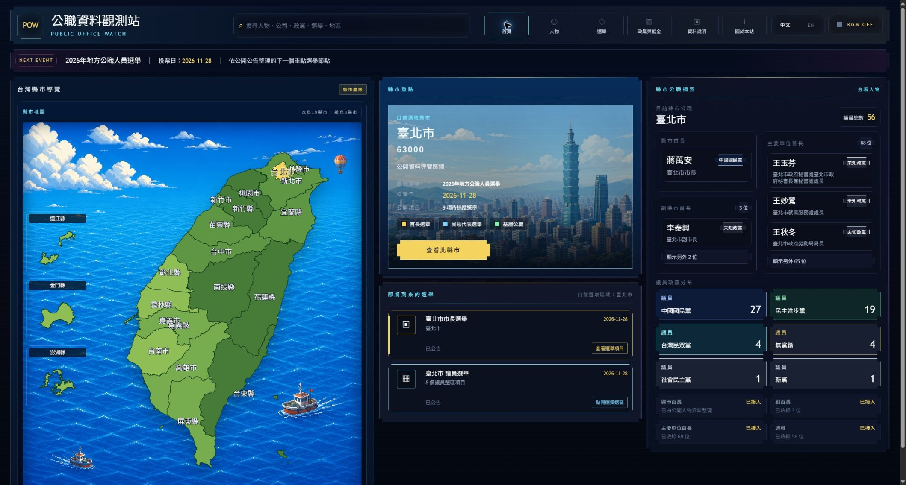
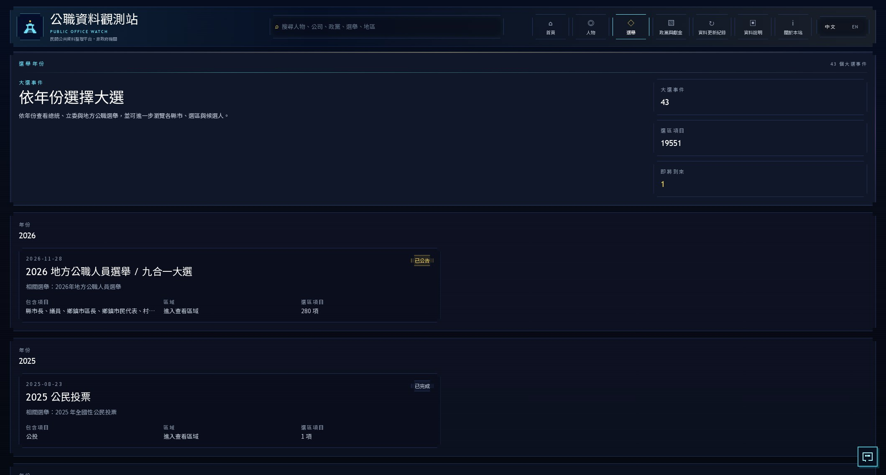
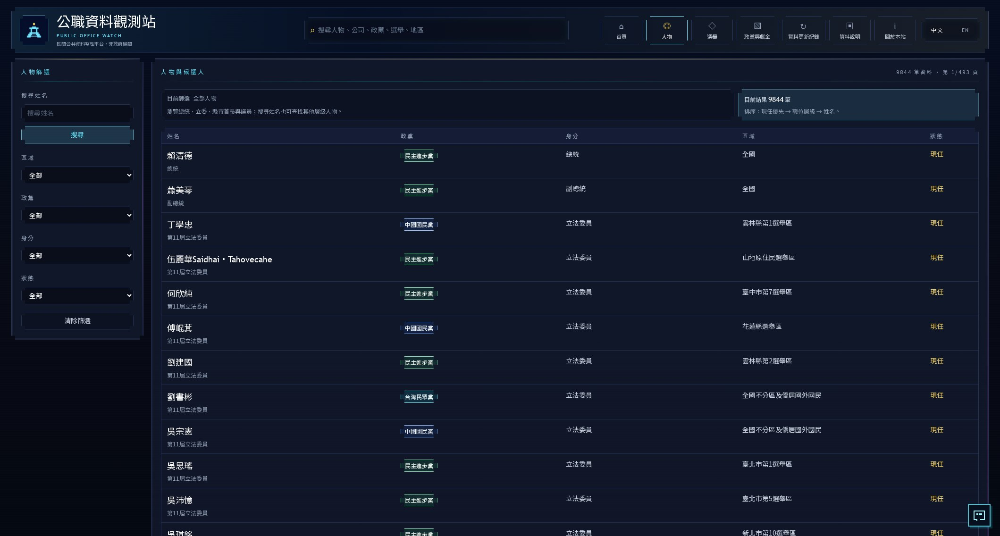
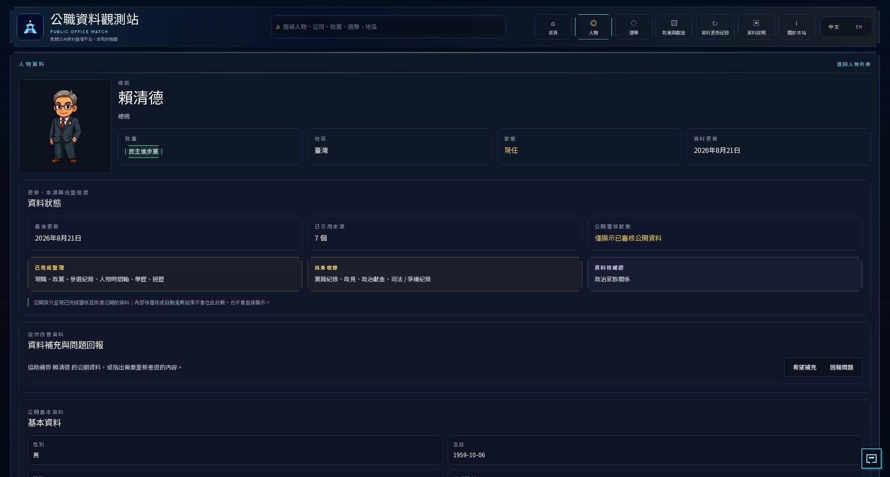
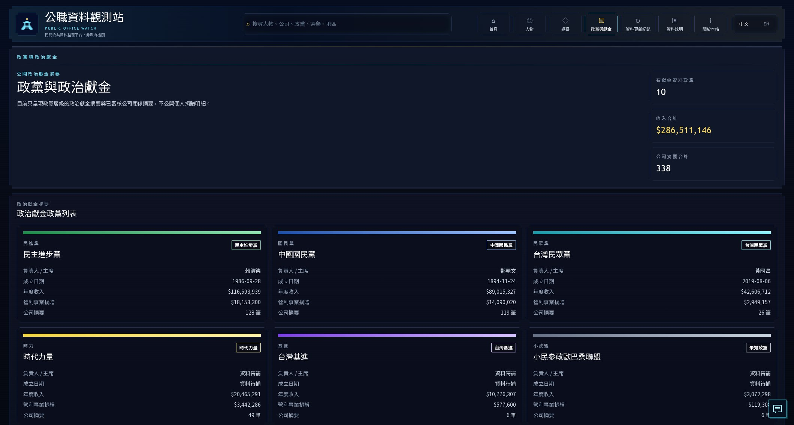

# Public Office Watch

Public Office Watch（公職資料觀測站）是一個以台灣選舉為入口的公開資料探索網站。使用者可以從全國總覽或縣市地圖出發，查看選舉、公職與候選人，並繼續追溯人物、政黨、參選紀錄、政見與政治獻金摘要。

專案將分散於中選會、政府機關與其他公開來源的資料，整理為可搜尋、可比較、保留來源且能逐步審核的結構化資訊。網站仍在持續補資料與校正階段，不將來源不足或尚未確認的內容包裝成確定事實。

- 原始碼：[GitHub](https://github.com/tyrionwei/public-office-watch)
- 問題與建議：[Issues](https://github.com/tyrionwei/public-office-watch/issues)
- 正式網站：[pow4vote.org](https://pow4vote.org)（Cloudflare Workers + Static Assets）

## 主要瀏覽流程

1. 從首頁查看全國摘要，或從地圖選擇縣市。
2. 查看全國／縣市重點、即將到來的選舉與現任公職摘要。
3. 進入大選總覽，依年份、選舉項目或縣市縮小範圍。
4. 查看單一選舉項目的選區、候選人、號次、得票與當選結果。
5. 從候選人前往人物頁，繼續查看經歷、黨籍與歷年參選紀錄。
6. 從公開更新動態確認本站最近已審核的資料新增與修正。

## 目前介面

### 首頁與縣市導覽

首頁預設顯示全國性選舉、正副總統、五院正副院長與立法委員政黨分布；也可從台灣地圖切換縣市。選取縣市後，中間會顯示該縣市的特色視覺、最近選舉與公開項目，下方列出即將到來的選舉；右側提供縣市首長、副首長、主要單位首長與議員政黨分布摘要。



### 選舉總覽與詳細資料

選舉頁先依年份顯示同一政治脈絡下的大選，例如總統與立法委員選舉、地方公職人員選舉／九合一大選。進入大選後，可從左側選擇公職類別、從右側選擇縣市，再查看各選區與選舉項目。

候選人依號次排序；已完成的選舉會顯示得票與當選結果，即將到來的選舉則顯示目前已公開的候選人資料。



### 人物搜尋與人物頁

人物列表支援姓名搜尋，以及地區、政黨、身分與狀態篩選，並提供欄位排序與分頁。全域搜尋也可從頁首直接查找人物、公司、政黨、選舉與地區。



人物頁以同一人物為主軸整合公開資訊，目前包含：

- 身分摘要、基本資料與現職
- 人物時間軸、學歷與經歷
- 黨籍紀錄
- 歷年參選紀錄、得票與當選結果
- 已審核線索與資料來源

人物合併不只依姓名判斷；同名資料仍需官方識別碼、選舉年份、選區、號次或其他可交叉確認資訊。



### 政黨與政治獻金

政黨頁整理政黨基本資料、相關人物與年度政治獻金摘要。政治獻金以政黨及公司層級的彙總資訊為主，不公開個人捐贈明細，並保留資料來源與更新時間。



### 公開更新動態與全站討論

公開更新動態集中列出本站最近已審核並公開的資料新增、修正與功能調整。它是資料變更紀錄，不是自動新聞流；每日與每週蒐集到的待查線索，必須先完成身分比對、來源確認與公開審核，才可列入。

全站聊天室以獨立的浮動介面提供短句即時交流。聊天室預設關閉，關閉後會取消 Realtime 訂閱；公開資料更新與聊天室訊息使用不同的資料與審核流程。

## 介面功能

- 中文／英文介面切換
- 頁首全域搜尋
- 選舉、人物與政黨的條件篩選與排序
- 已審核資料的公開更新動態
- 預設關閉的全站即時聊天室
- 可選擇開啟或關閉的背景音樂
- 桌面與手機版資料瀏覽介面

## 資料原則

- 官方來源優先，例如中選會、監察院、立法院、司法院與各級政府公開資料。
- 重要資料盡量保留來源名稱、來源連結與更新時間。
- 人物以「同一個人」為主軸整理；職位、黨籍、選區與參選紀錄視為歷史資料。
- 姓名相同不代表同一人，人物合併需要穩定識別資訊或足夠的交叉證據。
- 敏感資料採保守審核，不以單一同名或單篇報導直接公開。
- 政治獻金只呈現適合公開的摘要與彙總，不公開個人捐贈明細。
- 未審核、低可信或來源不足的資料會保留為線索，不作為確定事實呈現。
- 公開更新動態只讀取 `review_status = verified` 且明確核准公開的事件，不直接公開排程蒐集結果或內部審核紀錄。

本站使用 A／B／C／D 表示資料來源與比對狀態：A 為官方結構化資料，B 為可交叉確認的官方或高可信來源，C 為仍需人工確認的可信第三方資料，D 為來源不足或尚未完成比對的內部線索。分級不代表對人物或政黨的價值判斷。

## 開源、貢獻與 Codex 維護流程

本專案以 ISC License 公開原始碼，由核心維護者持續維護。歡迎透過 GitHub Issues 回報錯誤、補充可查核來源或提出功能建議，也可提交 Pull Request；涉及人物身分、選舉結果、政治獻金或其他敏感公開資料的變更，仍須依本站資料原則完成人工審核。

Codex 用於本專案的核心維護工作，包括理解程式與資料流程、實作與修正介面、補充測試、同步文件、檢查資料公開邊界，以及準備建置與發布。Codex 不會自動核准人物資料，也不會把未審核線索直接發布到正式資料庫；AI 協助的變更仍須通過相同的測試、來源檢查與人工確認。

本專案預計申請 [Codex for Open Source](https://developers.openai.com/community/codex-for-oss)，以支援公共資料專案的日常維護、審查、品質檢查與發布流程。此說明不代表本專案已獲 OpenAI 接受、贊助或背書。

## 本機啟動

需求：Node.js 22（或 Node.js 20.19 以上）與 npm。

```bash
npm install
npm --prefix apps/web install
npx supabase start
cp apps/web/.env.example apps/web/.env.local
npm --prefix apps/web run dev
```

本機開發與瀏覽器測試一律使用 Local Supabase。`apps/web/.env.example` 已固定使用 `http://127.0.0.1:54321` 與 `supabase` provider；複製後，請填入 `npx supabase status` 顯示的本機 anon／publishable key。正式站的 Supabase 設定由部署環境管理，不可複製到 `.env.local`，前端也不可使用 service role key。

完整檢查：

```bash
npm run check
```

此指令會執行前端 lint、正式建置、公開資料邊界與公開 view contract 檢查。

## Cloudflare 正式部署

正式網站託管於 Cloudflare Workers + Static Assets，`https://pow4vote.org` 是目前的正式入口。邊緣 Worker 提供安全標頭、SPA 路由、頁面 metadata、`robots.txt` 與 sitemap；靜態前端再以公開金鑰直接讀取 Supabase 的 `published` schema。Cloudflare 前端不可持有 service role key，Codex Sites 已不在目前的正式發布流程內。

在不連接 Cloudflare 帳號、不發布 Worker 的情況下，可執行本機建置與 Wrangler dry run：

```bash
npm --prefix apps/web run check:cloudflare
```

正式建置使用 `npm --prefix apps/web run build:cloudflare`，並要求非本機 HTTPS Supabase URL、`published` provider 與公開前端金鑰。通過完整檢查、Wrangler dry run 與 production smoke 後，由維護者在 `apps/web` 目錄執行 `npx wrangler deploy` 發布 `public-office-watch` Worker。`pow4vote.org` 的自訂網域與 DNS 由 Cloudflare 管理；`wrangler.jsonc` 已關閉 `workers.dev` 與 preview URL，正式流量只使用自訂網域。

## 專案結構

- `apps/web/`：React、TypeScript 與 Vite 前端
- `apps/web/worker/` 與 `apps/web/wrangler.jsonc`：Cloudflare Worker、Static Assets 與邊緣路由設定
- `supabase/`：資料庫 migration、公開 view 與相關設定
- `scripts/`：公開資料抓取、正規化、合併、同步與品質報告工具
- `data-sources/`：可追溯的資料來源清單與必要 seed；大型合併產物由腳本在本機產生
- `docs/`：資料規範、操作紀錄與 README 圖片

公開網站透過 `published` schema 讀取經審核且有界的資料。原始、待比對或內部審核資料不直接提供給瀏覽器；公開更新事件也必須經過同樣的明確核准流程。

## 專案狀態

目前已具備全國與縣市導覽、選舉總覽與詳細頁、人物搜尋與詳細頁、候選人政見、政黨統計與政治獻金摘要、公開更新動態、全站聊天室，以及中英文介面。後續工作仍包含人物與歷史資料補齊、來源審核、2026 正式候選人同步、政見履行情況追蹤與效能持續改善。

## 授權

程式碼依 [ISC License](LICENSE) 授權。資料與第三方來源仍受各原始來源的授權、使用條款與適用法規約束；程式碼授權不會改變來源資料本身的權利狀態。
